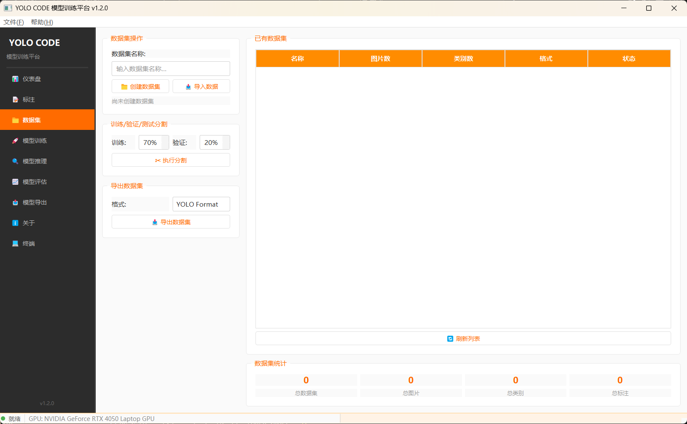
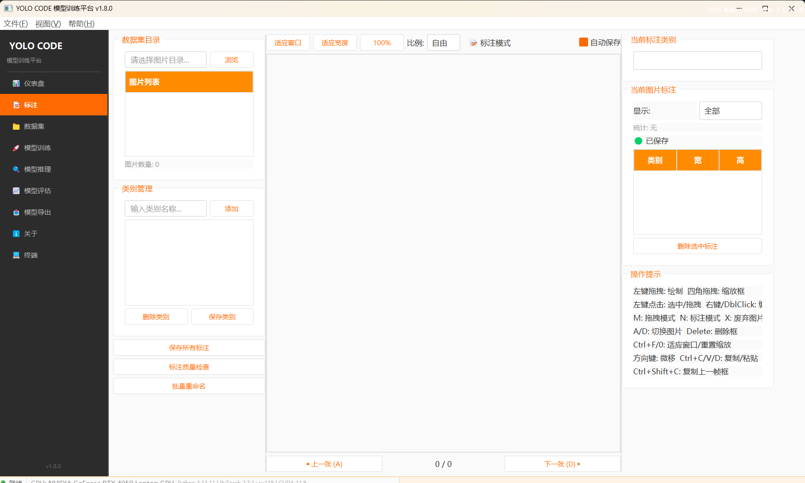
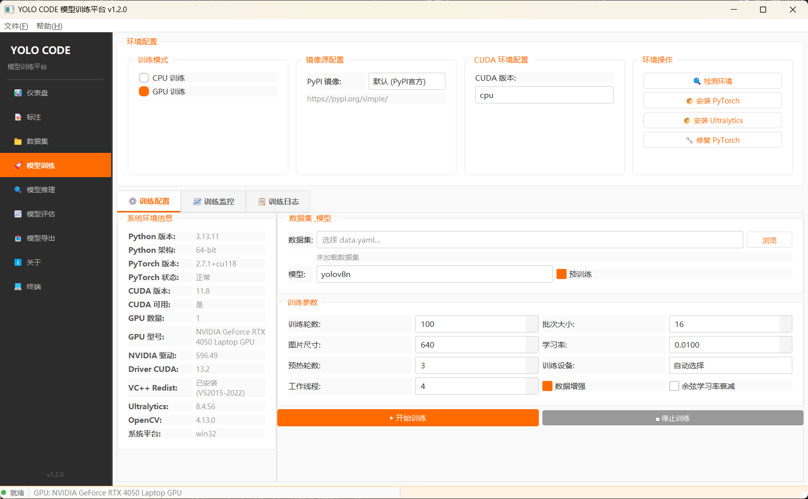
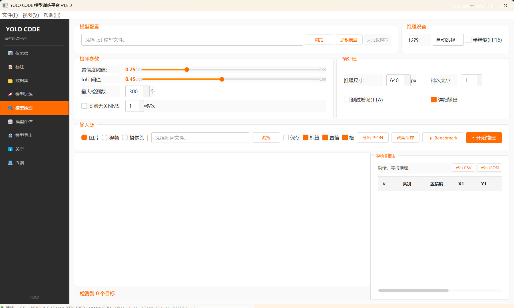
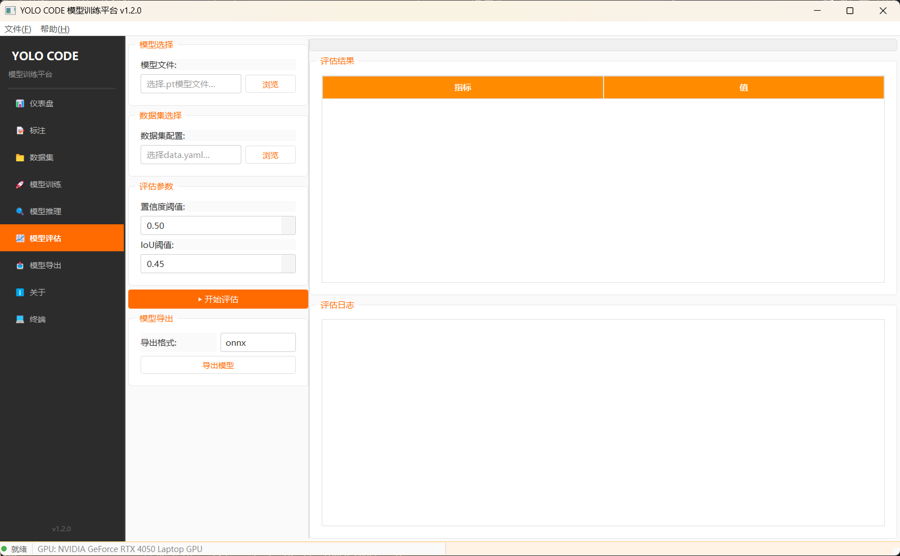
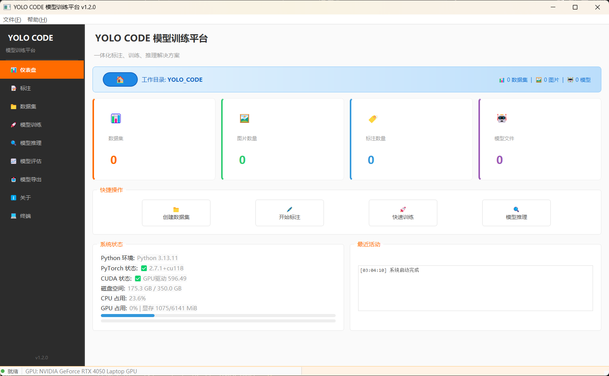

<p align="center">
  
</p>

<h1 align="center">YOLO CODE 模型训练平台</h1>

<p align="center">
  <strong>基于 Ultralytics YOLO 的一体化深度学习平台</strong>
</p>

<p align="center">
  数据集管理 → 手动标注 → 数据集分割 → 模型训练 → 模型推理 → 模型评估 → 模型导出
</p>

<p align="center">
  
  
  
  
</p>

---

## 📋 目录

- [功能模块](#功能模块)
- [系统要求](#系统要求)
- [安装指南](#安装指南)
- [使用流程](#使用流程)
- [界面预览](#界面预览)
- [引导模式](#引导模式)
- [标注快捷键](#标注快捷键)
- [模型导出格式](#模型导出格式)
- [项目结构](#项目结构)
- [常见问题](#常见问题)
- [详细文档](#详细文档)
- [未来规划](#未来规划)
- [联系方式](#联系方式)

---

## 📦 功能模块

| 模块 | 描述 |
|------|------|
| 📊 **仪表盘** | 项目概览、工作目录管理、系统状态监控、快捷操作、内存清理 |
| 🧭 **引导模式** | 7 步引导式流程：准备数据→标注→分割数据集→训练→推理→评估→导出 |
| 📝 **手动标注** | YOLO 格式标注，四角拖拽缩放，长宽比锁定，拖拽模式，标签过滤，复制粘贴，质量检查 |
| 📁 **数据集** | 创建/导入数据集（默认导入到工作目录），执行分割（train/val），自动生成 data.yaml |
| 🚀 **模型训练** | 一键环境检测修复，YOLO 全参数训练，实时 Loss/mAP 曲线，训练监控与日志，断点续训 |
| 🔍 **模型推理** | 图片/视频/摄像头检测，Benchmark 速度对比（PyTorch/ONNX/TRT），结果裁剪保存，CSV/JSON 导出 |
| 📈 **模型评估** | Per-class 指标，混淆矩阵，FP/FN 误检漏检分析，多模型对比 |
| 📤 **模型导出** | ONNX / TensorRT / OpenVINO / TFLite / TorchScript / CoreML 多格式导出 |
| 🎨 **主题切换** | Ctrl+T 一键切换深色/浅色主题 |

---

## 💻 系统要求

| 项目 | 要求 |
|------|------|
| **操作系统** | Windows 10+ / Linux / macOS |
| **Python** | 3.10 或更高 |
| **推荐硬件** | NVIDIA GPU（CUDA 支持）或 CPU |
| **内存** | 8GB 以上 |

---

## 🚀 安装指南

### 1. 克隆仓库

```bash
git clone https://github.com/HFGDHX/YOLO-CODE.git
cd YOLO-CODE
```

### 2. 安装依赖

```bash
pip install -r requirements.txt
```

### 3. 安装 GPU 版 PyTorch（可选）

有 NVIDIA GPU 时推荐，也可在软件内通过 **模型训练 → 安装 PyTorch** 完成。

```bash
pip install torch torchvision torchaudio --index-url https://download.pytorch.org/whl/cu121
```

### 4. 启动

**三端通用** — Windows / Linux / macOS 统一入口：

```bash
python start.py
```

启动器会自动检测 Python 版本、检查依赖并安装缺失项，然后启动软件。

---

## 📖 使用流程

从零开始完成一个目标检测项目的完整步骤：

### 第一步：设置工作目录

启动软件后进入 **仪表盘**，点击蓝色 🏠 按钮设置工作目录。所有数据集、模型、标注、推理结果都将保存在此目录下。

### 第二步：准备数据集



1. 切换到 **数据集** 模块
2. 输入数据集名称，点击 **"创建数据集"**（在 `datasets/<名称>/` 下创建目录结构）
3. 点击 **"导入数据"** 选择图片文件夹导入（文件复制到数据集目录），或直接将图片放入 `datasets/<名称>/images/` 下
4. 此时可以去标注（第三步），也可以先执行分割
5. 数据集统计会显示图片和标注数量（递归扫描 train/val 子目录）
6. 如需分割训练/验证集，设置比例后点击 **"执行分割"**（标注完成后操作）
7. 点击 **"保存 YAML"** 手动生成或更新 `data.yaml` 配置文件

> 💡 **推荐流程**：创建数据集 → 导入图片 → 全部标注 → 执行分割 → 保存 YAML → 训练

### 第三步：标注数据



1. 切换到 **手动标注** 模块
2. 点击 "浏览" 选择数据集中的 `images/` 目录（软件会自动识别上级为数据集根目录）
3. 添加类别名称（如 `dog`、`cat`、`person`），类别保存到 `classes.txt`
4. **左键拖拽** 绘制标注框，绘制中可锁定长宽比
5. **选中标注框** 后拖拽四角手柄可缩放框大小
6. 按 **M** 进入拖拽模式平移画面，按 **N** 回到标注模式
7. 右键或双击标注框可编辑/切换类别
8. 按 **A / D** 或 **← / →** 切换图片，勾选"自动保存"后切图自动保存
9. 工具栏按钮：
   - 🔍 **适应窗口** / **适应宽度** — 自动调整显示比例
   - 🔒 **锁定长宽比** — 绘制矩形时保持比例
   - 🏷 **标签过滤** — 只显示特定类别的标注框
   - ✅ **自动保存** — 切换图片时自动保存标注
   - 📋 **质量检查** — 检测漏标、空标注、坐标越界等问题
   - ✏ **批量重命名** — 批量修改类别名称
10. 点击 "保存所有标注"，标注文件保存为 YOLO 格式到 `labels/` 目录

### 第四步：分割数据集

1. 标注全部完成后，回到 **数据集** 模块
2. 在数据集中选择已标注的数据集
3. 设置训练/验证集比例（默认 8:2），点击 **"执行分割"**
4. 系统自动将图片和标注随机分配到 `images/train/`、`labels/train/`、`images/val/`、`labels/val/`
5. 分割完成后会自动生成 `data.yaml` 配置文件（也可手动点击"保存 YAML"）
6. ⚠️ **重要**：分割必须在全部标注完成后执行，分割后再训练

### 第五步：训练模型



1. 切换到 **模型训练** 模块
2. 展开 **"▸ 系统环境信息"** 查看 Python/PyTorch/CUDA/GPU 状态
3. 如环境异常，点击 **"检测环境"** 一键诊断修复
4. 选择数据集的 `data.yaml` 文件（或点击"自动生成"从数据集目录生成）
5. 选择模型（推荐 `yolov8n` 入门，可勾选"预训练"权重）
6. 调整训练参数（epochs、batch、imgsz、优化器、学习率等），点击 **"开始训练"**
7. 在 **训练监控** 页查看实时 Loss/mAP 曲线和指标
8. 在 **训练日志** 页查看终端风格日志，支持导出和自动滚动
9. 训练完成后模型保存在 `runs/train/` 下，可中断后续训

### 第六步：推理测试



1. 切换到 **模型推理** 模块
2. 浏览选择训练好的 `.pt` 模型并点击 **"加载模型"**
3. 选择输入源（图片 / 视频 / 摄像头）
4. 调整参数：置信度阈值（conf）、IoU 阈值（iou）、最大检测数（max_det）
5. 点击 **"开始推理"** 查看检测结果
6. 推理结果可导出为 **CSV**（每框坐标+置信度）或 **JSON**（结构化数据）
7. 可按类别裁剪保存检测到的小图为单独文件
8. 点击 ⚡ **Benchmark** 测试推理速度，对比 PyTorch / ONNX / TensorRT 的 FPS 和显存占用
9. 支持 GPU 和 CPU 推理切换

### 第七步：评估与部署



**模型评估：**
1. 切换到 **模型评估** 模块，选择模型和 data.yaml
2. 点击 **"开始评估"**，查看 5 个维度的结果：
   - 📊 **摘要**：mAP@50、mAP@50-95、精确率、召回率
   - 📋 **Per-Class**：每个类别的 AP、 Precision、Recall
   - ❌ **误检分析**：FP（误检）/ FN（漏检）样本详情
   - 🔲 **混淆矩阵**：可视化分类混淆情况
   - 📈 **对比**：加载多个模型进行横向对比

**模型导出：**
1. 切换到 **模型导出** 模块
2. 选择训练好的 `.pt` 模型
3. 选择导出格式（推荐 **ONNX** 用于跨平台部署）
4. 点击导出，模型将保存到同目录下

---

## 🖥 界面预览

### 仪表盘



> 状态指示灯：🟢 绿色就绪 / 🔴 红色训练中

### 训练监控

训练页面包含三个子标签页：

| 子页 | 内容 |
|------|------|
| **训练配置** | 环境检测修复、数据集模型选择、训练参数 |
| **训练监控** | 实时 Loss/mAP 曲线、指标表格（当前值 / 最佳值） |
| **训练日志** | 终端风格全屏日志，支持导出和自动滚动 |

---

## 🧭 引导模式

不想手动摸索？点击侧边栏 **🧭 引导模式** 进入 7 步引导式流程：

```
📁 准备数据 → 📝 标注数据 → ✂ 分割数据集 → 🚀 训练模型 → 🔍 推理测试 → 📈 评估模型 → 📤 导出部署
```

- 每步完成后再进入下一步，已完成的步骤显示绿色对勾，当前步骤显示橙色高亮
- 点击每一步的按钮即可跳转到对应功能页面
- ⚠️ 分割数据集在标注完成后才可执行，引导模式会明确提示顺序

---

## ⌨ 标注快捷键

### 标注操作

| 快捷键 | 功能 |
|--------|------|
| 鼠标左键拖拽 | 绘制新标注框 |
| 拖拽四角手柄 | 缩放标注框（选中框后） |
| 鼠标左键拖拽框 | 移动标注框 |
| 鼠标滚轮 | 缩放图片 |
| **Delete** | 删除选中标注框 |
| **Esc** | 取消当前绘制 / 取消选中 |
| 右键 / 双击框 | 编辑标注类别 |

### 图片浏览

| 快捷键 | 功能 |
|--------|------|
| **A** / **←** | 上一张图片 |
| **D** / **→** | 下一张图片 |
| **M** | 进入拖拽模式（拖移画面，不可标注） |
| **N** | 回到标注模式 |

### 高级操作

| 快捷键 | 功能 |
|--------|------|
| **Ctrl + C** | 复制当前图片的全部标注框 |
| **Ctrl + V** | 粘贴复制的标注框到当前图片 |
| **Ctrl + Shift + C** | 复制上一帧标注框（视频抽帧标注场景） |
| **Ctrl + D** | 复制选中的标注框（偏移 20px） |
| **X** | 标记当前图片为废弃（写入 discarded.txt） |
| **Ctrl + Z** | 撤销废弃标记 |

### 视图控制

| 快捷键 | 功能 |
|--------|------|
| **Ctrl + F** | 适应窗口显示 |
| **Ctrl + Shift + F** | 适应宽度显示 |
| **Ctrl + 0** | 重置缩放至 100% |
| **Ctrl + H** | 隐藏 / 显示所有标注框 |
| **方向键** | 微移选中框 1px（Shift + 方向键 加速 ×10） |

### 全局快捷键

| 快捷键 | 功能 |
|--------|------|
| **Ctrl + T** | 切换深色 / 浅色主题 |
| **Ctrl + S** | 保存当前图片标注 |

---

## 📤 模型导出格式

| 格式 | 适用场景 |
|------|---------|
| **ONNX** | 跨平台推理（推荐） |
| **TensorRT** | NVIDIA GPU 极致加速 |
| **OpenVINO** | Intel CPU / GPU 优化 |
| **TFLite** | 移动端 / 嵌入式设备 |
| **TorchScript** | PyTorch 生态部署 |
| **CoreML** | Apple 设备部署 |

---

## 📁 项目结构

```
YOLO_CODE/
├── main.py                  # 程序入口
├── start.py                 # 跨平台启动器（自动检查依赖）
├── requirements.txt         # Python 依赖列表
├── README.md                # 项目文档
├── docs/                    # 详细文档
│   ├── INSTALL.md           # 安装配置指南
│   ├── API.md               # 核心 API 参考
│   ├── FAQ.md               # 常见问题解答
│   ├── TROUBLESHOOTING.md   # 故障排查指南
│   └── DEV_GUIDE.md         # 二次开发指南
├── ui/
│   ├── __init__.py
│   ├── main_window.py       # 主窗口 + 全部页面组件（含引导模式）
│   └── annotation_canvas.py # 标注画布（纯渲染层）
├── core/
│   ├── __init__.py
│   ├── annotation.py        # 标注数据管理 + 图片缓存
│   ├── training.py          # 训练管理 + QThread 工作线程
│   ├── inference.py         # 推理管理 + 固定分色 + 视频推理
│   └── evaluation.py        # 全面评估 + 多模型对比
└── utils/
    ├── __init__.py
    ├── config.py             # 全局配置 + 工作目录 + 记忆功能
    ├── helpers.py            # YAML 工具 + checkpoint 查找
    └── validator.py          # 数据集验证 + 标注质量检查
```

---

## ❓ 常见问题

<details>
<summary><strong>PyTorch 加载失败 (c10.dll)</strong></summary>

软件内操作：**模型训练 → 环境操作 → 修复 PyTorch**
</details>

<details>
<summary><strong>GPU 不显示</strong></summary>

- 安装 NVIDIA 驱动
- **模型训练 → 安装 PyTorch** 选择 CUDA 版本
</details>

<details>
<summary><strong>训练显存不足</strong></summary>

- 减小批次大小（如 8 或 4）
- 减小图片尺寸（如 320）
- 使用更小模型（如 `yolov8n`）
</details>

<details>
<summary><strong>标注颜色异常</strong></summary>

图片颜色通道已校准，如仍有问题请检查图片格式。
</details>

<details>
<summary><strong>下载速度慢</strong></summary>

**模型训练 → 镜像源配置** 切换清华或阿里云镜像。
</details>

---

## 📚 详细文档

| 文档 | 说明 |
|------|------|
| [安装配置指南](docs/INSTALL.md) | 系统要求、详细安装步骤、配置说明 |
| [API 文档](docs/API.md) | 核心模块 API 参考 |
| [常见问题 FAQ](docs/FAQ.md) | 20+ 常见问题解答 |
| [故障排查指南](docs/TROUBLESHOOTING.md) | 启动/PyTorch/训练/推理问题排查 |
| [二次开发指南](docs/DEV_GUIDE.md) | 项目架构、开发原则、添加功能 |
| [🔮 未来规划](Future_Update.md) | 版本路线图、优先级、技术方案 |

---

## 📧 联系方式

如有问题或建议，欢迎联系：

📮 **Email**: [2807087688@qq.com](mailto:2807087688@qq.com)

---

<p align="center">
  <strong>YOLO CODE</strong> v1.9 — Built with Ultralytics YOLO + PyQt5 + Matplotlib
</p>
